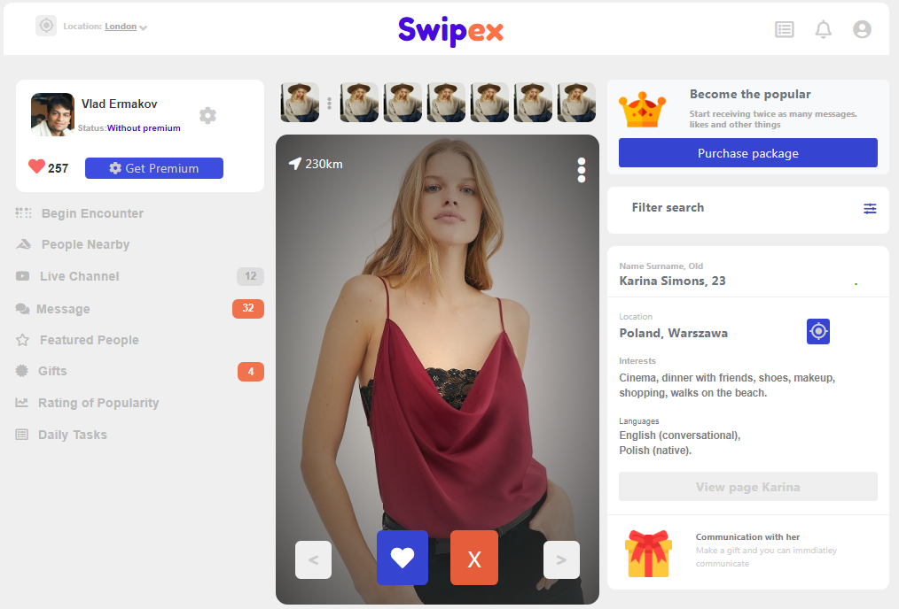
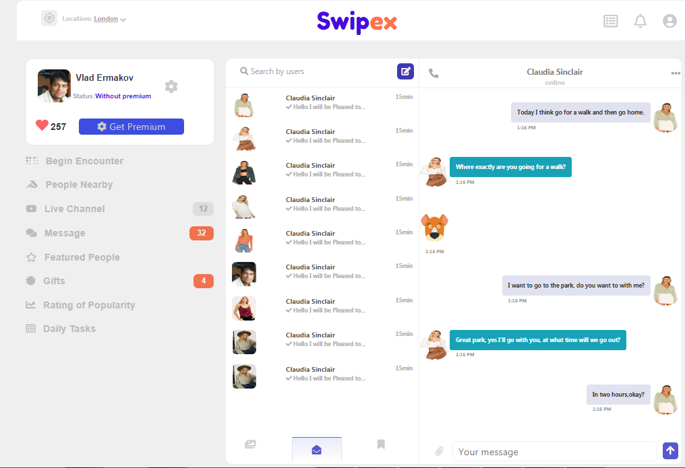

# capstoneproject

> This project is from [Microverse](https://www.microverse.org/) main curriculum.

This is a Microverse capstone project based on html css social network for finding acquittances. The project has three pages. The person detail page, with a link to the next/previous person detail and a link to the chat page. the chat page, with a list of chats that link to the chat detail page. The screen page has two break point for mobile screen size and desktop.

## The main page

## The Chat details page

## Built With

- [HTML](https://developer.mozilla.org/en-US/docs/Web/HTML),
- [CSS](https://www.w3schools.com/css/),
- [Fontawesome](https://fontawesome.com/)
- [Bootstrap](https://www.w3schools.com/bootstrap4/bootstrap_utilities.asp)
- [Flat Icon](https://www.flaticon.com)
- [Google fonts](https://fonts.google.com)

## Live Demo

[Live Demo Link](https://ugochukwuomeje.github.io/capstoneproject/)

## Project Explanation

[Project explanation](https://www.loom.com/share/9db3fcdeabc34e118cf344cffd645dfd)

## Getting Started

-Use `git clone https://github.com/ugochukwuomeje/capstoneproject.git` 

### Setup
Use `npm install` to set up all of the dependencies and CSS linters

## Authors

👤 **Author1**

- Github: [ugochukwu](https://github.com/ugochukwuomeje)

## 🤝 Contributing

Contributions, issues and feature requests are welcome!

Feel free to check the [issues page](issues/).

Feel free to clone
